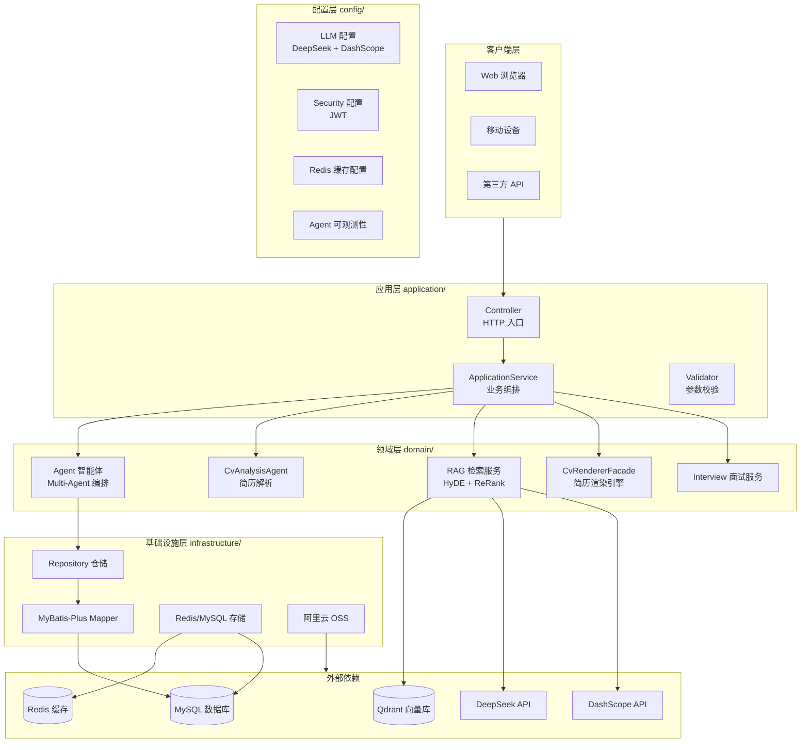
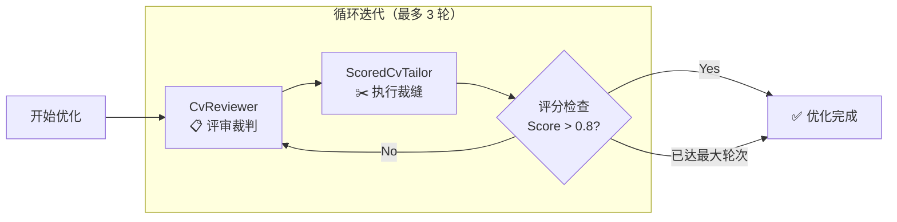
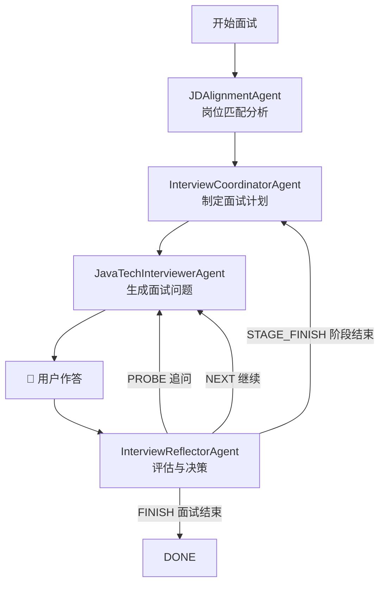
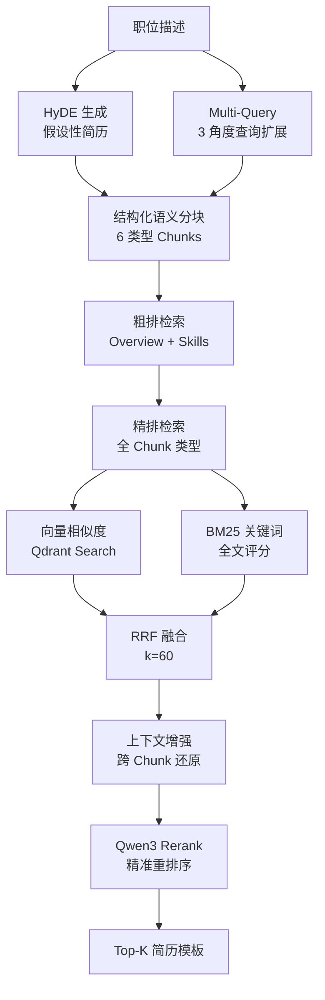
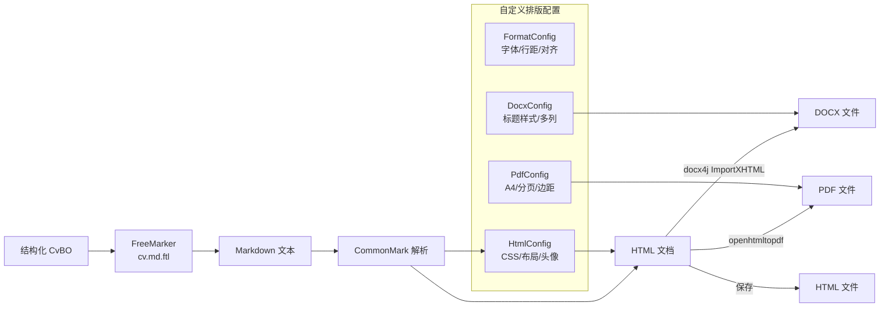

# JobSpark 智能招聘辅助平台

[](https://www.oracle.com/java/)
[](https://spring.io/projects/spring-boot)
[](https://docs.langchain4j.dev/)
[](https://baomidou.com/)
[](https://qdrant.tech/)
[](https://redis.io/)
[](LICENSE)
[![Zread](https://img.shields.io/badge/Ask_Zread-_.svg?style=flat&color=00b0aa&labelColor=000000&logo=data%3Aimage%2Fsvg%2Bxml%3Bbase64%2CPHN2ZyB3aWR0aD0iMTYiIGhlaWdodD0iMTYiIHZpZXdCb3g9IjAgMCAxNiAxNiIgZmlsbD0ibm9uZSIgeG1sbnM9Imh0dHA6Ly93d3cudzMub3JnLzIwMDAvc3ZnIj4KPHBhdGggZD0iTTQuOTYxNTYgMS42MDAxSDIuMjQxNTZDMS44ODgxIDEuNjAwMSAxLjYwMTU2IDEuODg2NjQgMS42MDE1NiAyLjI0MDFWNC45NjAxQzEuNjAxNTYgNS4zMTM1NiAxLjg4ODEgNS42MDAxIDIuMjQxNTYgNS42MDAxSDQuOTYxNTZDNS4zMTUwMiA1LjYwMDEgNS42MDE1NiA1LjMxMzU2IDUuNjAxNTYgNC45NjAxVjIuMjQwMUM1LjYwMTU2IDEuODg2NjQgNS4zMTUwMiAxLjYwMDEgNC45NjE1NiAxLjYwMDFaIiBmaWxsPSIjZmZmIi8%2BCjxwYXRoIGQ9Ik00Ljk2MTU2IDEwLjM5OTlIMi4yNDE1NkMxLjg4ODEgMTAuMzk5OSAxLjYwMTU2IDEwLjY4NjQgMS42MDE1NiAxMS4wMzk5VjEzLjc1OTlDMS42MDE1NiAxNC4xMTM0IDEuODg4MSAxNC4zOTk5IDIuMjQxNTYgMTQuMzk5OUg0Ljk2MTU2QzUuMzE1MDIgMTQuMzk5OSA1LjYwMTU2IDE0LjExMzQgNS42MDE1NiAxMy43NTk5VjExLjAzOTlDNS42MDE1NiAxMC42ODY0IDUuMzE1MDIgMTAuMzk5OSA0Ljk2MTU2IDEwLjM5OTlaIiBmaWxsPSIjZmZmIi8%2BCjxwYXRoIGQ9Ik0xMy43NTg0IDEuNjAwMUgxMS4wMzg0QzEwLjY4NSAxLjYwMDEgMTAuMzk4NCAxLjg4NjY0IDEwLjM5ODQgMi4yNDAxVjQuOTYwMUMxMC4zOTg0IDUuMzEzNTYgMTAuNjg1IDUuNjAwMSAxMS4wMzg0IDUuNjAwMUgxMy43NTg0QzE0LjExMTkgNS42MDAxIDE0LjM5ODQgNS4zMTM1NiAxNC4zOTg0IDQuOTYwMVYyLjI0MDFDMTQuMzk4NCAxLjg4NjY0IDE0LjExMTkgMS42MDAxIDEzLjc1ODQgMS42MDAxWiIgZmlsbD0iI2ZmZiIvPgo8cGF0aCBkPSJNNCAxMkwxMiA0TDQgMTJaIiBmaWxsPSIjZmZmIi8%2BCjxwYXRoIGQ9Ik00IDEyTDEyIDQiIHN0cm9rZT0iI2ZmZiIgc3Ryb2tlLXdpZHRoPSIxLjUiIHN0cm9rZS1saW5lY2FwPSJyb3VuZCIvPgo8L3N2Zz4K&logoColor=ffffff)](https://zread.ai/Teng-Yii/JobSpark-Resume)

---

## 📋 目录

- [1. 项目简介](#1-项目简介)
- [2. 核心技术栈](#2-核心技术栈)
- [3. 系统架构](#3-系统架构)
- [4. 核心功能与技术亮点](#4-核心功能与技术亮点)
  - [4.1 多智能体协作框架](#41-多智能体协作框架)
  - [4.2 生产级 RAG 流水线](#42-生产级-rag-流水线)
  - [4.3 多格式简历渲染管线](#43-多格式简历渲染管线)
  - [4.4 Agent 可观测性系统](#44-agent-可观测性系统)
  - [4.5 AI 智能简历解析与优化](#45-ai-智能简历解析与优化)
  - [4.6 异步任务处理](#46-异步任务处理)
- [5. 项目结构](#5-项目结构)
- [6. 快速开始](#6-快速开始)
- [7. API 概览](#7-api-概览)
- [8. 模块详解](#8-模块详解)

---

## 1. 项目简介

**JobSpark** 是一款基于大语言模型（LLM）和检索增强生成（RAG）技术的智能招聘与求职辅助平台，由 **TengYii** 团队开发。系统致力于通过 AI 技术解决招聘过程中的痛点，提供智能简历解析、简历优化、精准人岗匹配、AI 面试模拟等核心功能，提升招聘与求职的效率和质量。

系统采用 **Java 17 + Spring Boot 3.4** 技术栈，以 **LangChain4j** 作为 AI 智能体框架，深度融合 **DeepSeek V4 Flash**（主对话模型）+ **DashScope text-embedding-v4/Qwen3 Rerank**（向量模型）的混合 LLM 架构，构建了完整的 Multi-Agent 协同工作流、生产级 RAG 检索流水线和多格式简历渲染引擎。

---

## 2. 核心技术栈

| 分类 | 技术 | 版本 | 用途 |
|------|------|------|------|
| **基础框架** | Spring Boot | 3.4.2 | 应用容器、IoC、自动配置 |
| | Java | 17 | 运行环境 |
| | Lombok | 可选 | 代码简化 |
| **ORM/数据库** | MyBatis-Plus | 3.5.12 | ORM 框架，支持代码生成 |
| | Dynamic Datasource | 4.3.0 | 多数据源动态切换 |
| | MySQL Connector | 8.x | MySQL 驱动 |
| **AI/LLM** | LangChain4j Core | 1.13.0 | LLM 交互框架 |
| | LangChain4j Agentic | 1.13.0-beta23 | 智能体编排框架 |
| | LangChain4j MCP | 1.13.0-beta23 | Model Context Protocol |
| | LangChain4j OpenAI Starter | 1.13.0-beta23 | OpenAI 兼容 API |
| | DeepSeek V4 Flash | — | 主对话模型（150s 超时） |
| | DashScope text-embedding-v4 | — | 文本向量化模型（1024维） |
| | Qwen3 Rerank | — | 检索重排序模型 |
| **向量存储** | Qdrant | 1.16.0 | 向量数据库 |
| **缓存** | Redis (Spring Data) | — | 缓存 + Agent Trace 热存储 |
| **安全** | Spring Security | — | 认证授权框架 |
| | JJWT | 0.11.5 | JWT Token 签发验证 |
| **文档渲染** | FreeMarker | — | 简历模板引擎 |
| | CommonMark | 0.22.0 | Markdown → HTML 渲染 |
| | docx4j | 11.5.6 | DOCX 文档生成 |
| **云存储** | Alibaba Cloud OSS | 3.17.4 | 文件对象存储 |
| **API 文档** | SpringDoc OpenAPI | 2.7.0 | 自动 API 文档生成 |
| **工具库** | HuTool | 5.8.41 | Java 工具类库 |
| | Guava | 33.5.0 | Google 工具库 |
| | Apache Commons | — | 通用工具类 |

---

## 3. 系统架构

### 3.1 分层架构

系统采用经典的分层架构设计，各层职责清晰：



### 3.2 六大模块职责

| 模块 | 对应路径 | 核心职责 |
|------|---------|---------|
| **application** | `application/` | HTTP 请求接收、参数校验、业务编排（`ResumeController`、`InterviewController`） |
| **domain** | `domain/` | 核心业务逻辑（Agent 智能体编排、RAG 检索、简历渲染引擎、面试协调） |
| **infrastructure** | `infrastructure/` | 数据持久化、第三方存储适配（Mapper、Repository、Redis、OSS） |
| **config** | `config/` | 集中配置（LLM 参数、安全策略、缓存、CV 格式模板、可观测性） |
| **common** | `common/` | 跨模块通用能力（工具类、枚举定义、异常处理、常量管理） |
| **model** | `model/` + `dto/` | 数据结构与传输对象（PO 持久化对象、BO 业务对象、DTO 传输对象） |

---

## 4. 核心功能与技术亮点

### 4.1 多智能体协作框架

系统基于 **LangChain4j Agentic** 框架，构建了一套完整的 **Plan-and-Execute** 多智能体协作体系，覆盖简历优化与面试模拟两大核心场景。

#### CV 优化：裁判-执行者双智能体循环



- **CvReviewer（裁判）**：模拟资深面试官身份，按照技术能力 35%、经验匹配 30%、项目经验 25%、教育背景 10% 的加权评分体系对简历打分（0-1 区间）
- **ScoredCvTailor（执行者）**：根据评审反馈对简历进行定向优化，严格遵循 **不编造信息** 原则，仅通过重构表述、STAR 法量化和技能重排提升简历质量
- **CvOptimizationAgent（循环控制器）**：`@LoopAgent` 注解标识，通过 `@ExitCondition`（Score > 0.8）控制退出时机，实时通过 SSE 推送优化进度

#### 面试模拟：多智能体编排流水线



- **JDAlignmentAgent**：分析 JD 与简历的技能匹配度，输出结构化 `JDAlignmentResultBO`（匹配分数、已匹配技能、缺失技能、关注领域）
- **InterviewCoordinatorAgent**：制定 5 阶段面试计划（自我介绍、Java 基础、系统设计、深度技术、综合评估）
- **JavaTechInterviewerAgent**：执行具体面试提问，支持 **探针模式**（Probe Mode）— 根据作答生成跟进问题
- **InterviewReflectorAgent**：从 5 个维度（准确性、深度、经验、清晰度、问题解决）评分 0-10，决策下一动作
- **混合压缩记忆（HybridCompactingChatMemory）**：消息超过 30 条时自动对低重要性消息进行 LLM 压缩摘要，同时保留高重要性消息原貌

### 4.2 生产级 RAG 流水线

系统构建了一套完整的 **端到端 RAG 检索流水线**，用于简历模板的智能检索与匹配。代码位于 `domain/service/cv/ResumeRagService.java`。



#### 流水线核心环节：

| 环节 | 技术实现 | 说明 |
|------|---------|------|
| **HyDE 生成** | DeepSeek 生成假设简历 | 基于 JD 生成理想候选人简历摘要，Redis 缓存 1 小时，用于扩展语义空间 |
| **Multi-Query** | LLM 自动生成 3 种查询变体 | 技术栈角度、行业角度、同义改写角度，Redis 缓存 1 小时 |
| **语义分块** | 6 种结构化 Chunk 类型 | `overview`、`summary`、`skills`、`experience`、`project`、`education`，每 chunk 携带完整元数据 |
| **分层检索** | 粗排 + 精排两阶段 | 先搜索 overview+skills 识别候选简历 ID，再对所有 Chunk 类型精细化检索 |
| **混合搜索** | 向量 + BM25 + RRF 融合 | 向量相似度（Qdrant）+ BM25 关键词得分 + Reciprocal Rank Fusion（k=60） |
| **上下文增强** | 跨 Chunk 合并还原 | 将属于同一简历的多个 Chunk 合并为完整、按时间排序的简历文本 |
| **Rerank** | DashScope qwen3-vl-rerank | 最终精准度排序，将最匹配的简历模板排在首位 |

### 4.3 多格式简历渲染管线

系统构建了 **CvBO → Markdown → HTML → PDF/DOCX** 的完整渲染流水线。



- **模板引擎**：FreeMarker 渲染 `cv.md.ftl` 模板生成 Markdown
- **HTML 转换**：CommonMark 解析 Markdown，结合 CSS 样式生成 HTML
- **PDF 生成**：通过 docx4j 的 openhtmltopdf 引擎转换 HTML → PDF（A4 页面、严格分页控制）
- **Word 生成**：docx4j ImportXHTML 转换 HTML → DOCX（支持双列布局）
- **排版配置**：使用 **Noto Sans SC**（10 字重）字体，统一日期格式、行间距、对齐方式
- **字段校验**：`CvValidator` 严格校验必填字段（姓名、联系方式、教育经历）

### 4.4 Agent 可观测性系统

系统构建了一套完整的 **事件驱动的全链路追踪** 体系，对 Agent 的运行状态进行全方位监控。

```mermaid
graph TB
    subgraph Agent["Agent 执行"]
        A1[JDAlignmentAgent]
        A2[InterviewCoordinator]
        A3[JavaTechInterviewer]
        A4[InterviewReflector]
    end

    subgraph Listener["AgentListener 层"]
        AF[AgentListenerFactory<br/>工厂类 + 类型缓存]
        PL[PersistableAgentListener<br/>事件采集器]
    end

    subgraph Event["Spring 事件总线"]
        IE[AgentInvocationEvent<br/>智能体调用事件]
        TE[AgentToolExecutionEvent<br/>工具执行事件]
    end

    subgraph Persist["持久化层"]
        ATP[AgentTracePersistService<br/>双写策略]
        REDIS[(Redis 缓存<br/>热数据)]
        MYSQL[(MySQL 持久化<br/>agent_execution_trace)]
    end

    Agent -->|before/after/onError| PL
    PL -->|publishEvent| IE
    PL -->|publishEvent| TE
    IE -->|@EventListener| ATP
    TE -->|@EventListener| ATP
    ATP --> REDIS
    ATP --> MYSQL
```

#### 可观测性设计要点：

- **事件驱动架构**：基于 Spring `ApplicationEvent` + `@EventListener`，非侵入式采集
- **双存储策略**：Redis（实时热数据，快查快写）+ MySQL（持久化归档，用于分析）
- **完整链路追踪**：记录 `traceId`、`sessionId`、`memoryId`、`agentName`、`parentAgentId`、时间戳、耗时、输入/输出摘要、异常信息
- **5 种 Agent 类型**：JD_ALIGNMENT、INTERVIEW_COORDINATOR、JAVA_TECH_INTERVIEWER、INTERVIEW_REFLECTOR、GENERIC
- **3 张监控表**：`agent_execution_trace`（执行轨迹）、`agent_tool_invocation`（工具调用）、`agent_session_stats`（聚合统计）
- **工厂模式**：`AgentListenerFactory` 按 Agent 类型缓存 Listener，支持全局开关控制
- **线程隔离**：独立的 `agent-obs-` 线程池，DiscardOldestPolicy 饱和策略，保障不影响主业务

### 4.5 AI 智能简历解析与优化

- 基于 LLM（DeepSeek V4 Flash）深度解析 PDF 简历，自动提取结构化信息（个人资料、联系方式、教育经历、工作经历、项目经验、技能清单、证书等）
- 智能类型推断：`CvAnalysisAgent` 自动识别工作类型（全职/实习/兼职/自由职业）、技能熟练度和类别、所属行业
- 对抗式迭代优化：3 轮 Reviewer-Tailor 循环，将简历提升至面试级标准
- 严格 **不编造原则**：所有优化仅基于已有事实，不添加虚构经验或技能

### 4.6 异步任务处理

- 采用异步机制处理简历上传与解析等耗时任务，保障系统的高并发响应能力
- 双线程池设计：`resume-task-`（IO 密集型简历处理，CallerRunsPolicy 反压）+ `agent-obs-`（可观测性日志，DiscardOldestPolicy）
- 异步任务状态机：PROCESSING → ANALYZING → SAVING → COMPLETED/FAILED
- 任务进度可查询：客户端通过 `taskId` 轮询进度百分比和预估剩余时间
- 支持任务取消

---

## 5. 项目结构

```
JobSpark-Resume/
├── pom.xml                          # Maven 构建配置
├── sql/                             # 数据库 DDL 脚本
│   ├── cv.sql                       #   简历核心表（14 张）
│   ├── interview.sql                #   面试模块表（4 张）
│   └── agent_observability.sql      #   Agent 可观测性表（3 张）
├── skills/                          # LangChain4j Skills
│   ├── jd-alignment/                #   岗位匹配 Skill
│   └── question-probing/            #   面试追问 Skill
│
└── src/
    ├── main/
    │   ├── java/com/tengYii/jobspark/
    │   │   ├── Application.java                    # Spring Boot 启动入口
    │   │   │
    │   │   ├── application/                # ── 应用层 ──
    │   │   │   ├── controller/             #     REST API 控制器
    │   │   │   │   ├── AuthController.java        #   认证（/api/v1/auth）
    │   │   │   │   ├── ResumeController.java      #   简历（/api/v1/resumes）
    │   │   │   │   └── InterviewController.java   #   面试（/api/v1/interviews）
    │   │   │   └── service/               #     应用服务（业务编排）
    │   │   │       ├── ResumeApplicationService.java
    │   │   │       └── InterviewApplicationService.java
    │   │   │
    │   │   ├── domain/                    # ── 领域层（核心业务）──
    │   │   │   ├── agent/                 #     AI 智能体定义
    │   │   │   │   ├── cv/                #       CV 代理（CvAnalysisAgent、CvReviewer、ScoredCvTailor、CvOptimizationAgent）
    │   │   │   │   └── interview/         #       面试代理（JDAlignmentAgent、Coordinator、Interviewer、Reflector）
    │   │   │   └── service/               #     领域服务
    │   │   │       ├── cv/                #       简历解析/持久化/RAG/任务
    │   │   │       ├── interview/         #       面试协调器
    │   │   │       ├── qdrant/            #       Qdrant 向量存储适配
    │   │   │       └── observability/     #       Agent 可观测性
    │   │   │
    │   │   ├── infrastructure/            # ── 基础设施层 ──
    │   │   │   ├── mapper/                #     MyBatis-Plus Mapper 接口
    │   │   │   ├── repo/                  #     Repository 仓储实现
    │   │   │   └── store/                 #     存储适配（RedisChatMemoryStore、AgentTraceStore）
    │   │   │
    │   │   ├── config/                    # ── 配置层 ──
    │   │   │   ├── LlmConfig.java         #     LLM 配置（DeepSeek + DashScope）
    │   │   │   ├── RedisConfig.java       #     Redis 缓存配置
    │   │   │   ├── SecurityConfig.java    #     Spring Security + JWT
    │   │   │   ├── ExecutorConfig.java    #     线程池配置
    │   │   │   ├── WebConfig.java         #     Web/CORS 配置
    │   │   │   ├── listener/              #     Agent 监听器（可观测性）
    │   │   │   └── cv/                    #     简历格式配置（Markdown/PDF/DOCX/HTML）
    │   │   │
    │   │   ├── common/                    # ── 通用层 ──
    │   │   │   ├── enums/                 #     枚举（AgentType、ExecutionStatus）
    │   │   │   ├── exception/             #     全局异常处理
    │   │   │   └── util/                  #     工具类（RedisUtil、JwtTokenUtil）
    │   │   │
    │   │   ├── model/                     # ── 模型层 ──
    │   │   │   ├── po/                    #     持久化对象（对应数据库表）
    │   │   │   ├── bo/                    #     业务对象（CvBO、InterviewBO）
    │   │   │   └── llm/                   #     LLM 交互实体（CvReview、ScoredCandidate）
    │   │   │
    │   │   └── dto/                       # ── 传输对象 ──
    │   │       ├── request/               #     请求 DTO
    │   │       └── response/              #     响应 DTO
    │   │
    │   └── resources/
    │       ├── application.yml            # 主配置文件
    │       ├── mybatis/mapper/mysql/      # MyBatis XML 映射
    │       └── templates/                 # FreeMarker 简历模板
    │
    └── test/java/com/tengYii/jobspark/
        ├── cv/                            # 简历渲染管线和优化测试
        ├── bug/                           # LangChain4j Bug 复现测试
        ├── mcp/                           # MCP 连接测试
        └── model/                         # 集成测试（Rerank、Qdrant）
```

---

## 6. 快速开始

### 6.1 环境要求

- **JDK 17+**
- **Maven 3.6+**
- **MySQL 8.0+**
- **Redis 7.0+**
- **Qdrant**（RAG 检索所需）
- **DashScope API Key**（阿里云百炼平台获取）
- **DeepSeek API Key**

### 6.2 配置步骤

1. **克隆项目**
   ```bash
   git clone https://github.com/Teng-Yii/JobSpark-Resume.git
   cd JobSpark-Resume
   ```

2. **初始化数据库**
   ```bash
   # 创建数据库
   mysql -u root -p -e "CREATE DATABASE jobspark DEFAULT CHARSET utf8mb4;"
   # 导入 DDL 脚本
   mysql -u root -p jobspark < sql/cv.sql
   mysql -u root -p jobspark < sql/interview.sql
   mysql -u root -p jobspark < sql/agent_observability.sql
   ```

3. **配置 `application.yml`**
   ```yaml
   spring:
     datasource:
       url: jdbc:mysql://localhost:3306/jobspark
       username: root
       password: your_password
     data:
       redis:
         host: localhost
         port: 6379

   # LLM API 配置
   dashscope:
     api-key: ${DASHSCOPE_API_KEY:your_dashscope_key}
   deepseek:
     api-key: your_deepseek_key
   ```

4. **启动 Qdrant**
   ```bash
   docker run -d --name qdrant -p 6333:6333 -p 6334:6334 qdrant/qdrant
   ```

5. **启动应用**
   ```bash
   export DASHSCOPE_API_KEY=your_key_here
   mvn spring-boot:run
   ```

6. **访问 API 文档**
   - Swagger UI: `http://localhost:8080/swagger/swagger-ui`

---

## 7. API 概览

### 7.1 认证模块 `/api/v1/auth`

| 方法 | 路径 | 说明 |
|------|------|------|
| POST | `/login` | 用户登录，返回 JWT Token |
| POST | `/register` | 用户注册 |
| POST | `/sendForgetPasswordCode` | 发送重置密码验证码 |
| POST | `/forgetPassword` | 重置密码 |
| POST | `/logout` | 退出登录 |
| GET | `/validate` | 验证 Token 有效性 |
| GET | `/me` | 获取当前用户信息 |

### 7.2 简历模块 `/api/v1/resumes`

| 方法 | 路径 | 说明 |
|------|------|------|
| GET | `/list` | 列出用户简历列表 |
| GET | `/{resumeId}` | 获取简历详情 |
| POST | `/upload` | 上传 PDF 简历（异步，返回 taskId） |
| POST | `/optimize` | 同步优化简历（对照 JD） |
| POST | `/optimize/stream` | SSE 流式优化简历 |
| POST | `/generateOptimizedFile` | 生成优化后文件（PDF/HTML/DOCX） |
| GET | `/task/{taskId}/status` | 查询异步任务状态 |
| POST | `/task/{taskId}/cancel` | 取消异步任务 |
| POST | `/{resumeId}/embedding` | 简历向量化存储（Qdrant） |

### 7.3 面试模块 `/api/v1/interviews`

| 方法 | 路径 | 说明 |
|------|------|------|
| POST | `/sessions` | 创建面试会话 |
| POST | `/sessions/{sessionId}/continue` | 提交答案，获取下一题 |
| GET | `/sessions/{sessionId}/status` | 查询面试状态 |
| POST | `/sessions/{sessionId}/finish` | 结束面试 |

---

## 8. 模块详解

### 8.1 应用层 (application)

- **Controller**：RESTful API 入口，负责参数校验和路由分发（AuthController、ResumeController、InterviewController）
- **ApplicationService**：业务编排层，协调多个领域服务完成复杂业务流程

### 8.2 领域层 (domain)

系统的核心心脏，封装了最关键的业务逻辑：

- **Agent 智能体**：基于 LangChain4j Agentic 框架的 Multi-Agent 协作体系，涵盖简历解析（CvAnalysisAgent）、简历优化（CvOptimizationAgent → CvReviewer + ScoredCvTailor）、面试模拟（JDAlignmentAgent + Coordinator + Interviewer + Reflector）
- **RAG 检索服务**：完整的生产级 RAG 流水线（HyDE → Multi-Query → 分层检索 → 混合搜索 → Rerank）
- **简历渲染引擎**：CvBO → Markdown → HTML → PDF/DOCX 多格式转换管线
- **面试协调器**：多轮交互式面试的流程控制与状态管理

### 8.3 基础设施层 (infrastructure)

- **MyBatis-Plus Mapper**：15+ 个 Mapper 接口（基于 BaseMapper 自动 CRUD）
- **Repository**：仓储层，封装 PO ↔ BO 的复杂双向转换逻辑
- **存储适配**：RedisChatMemoryStore（Agent 记忆持久化）、AgentTraceStore（可观测性存储）、QdrantEmbeddingStore（向量存储）

### 8.4 配置层 (config)

- **LLM 配置**：双 LLM 策略 — DeepSeek V4 Flash（主推理）+ DashScope（向量/Rerank）
- **安全配置**：Spring Security + JWT（2 小时 Token 有效期），自定义 AuthInterceptor
- **线程池配置**：`resume-task-`（IO 密集）+ `agent-obs-`（轻量日志）
- **简历格式配置**：Markdown/PDF/DOCX/HTML 的自定义排版参数

---

## 数据库设计

### 简历模块（14 表）

包含 `user_info`、`cv`、`cv_contact`、`cv_social_link`、`cv_education`、`cv_experience`、`cv_project`、`cv_highlight`（多态关联）、`cv_skill`、`cv_certificate`、`cv_format_meta`、`cv_locale_config`、`resume_task`（异步任务）。

- 统一逻辑删除（`delete_flag`）
- UTC 时间戳 + 自动更新
- utf8mb4 字符集 + InnoDB 引擎
- 按查询模式设计复合索引

### 面试模块（4 表）

`interview_session`（面试会话）、`interview_plan`（阶段计划）、`interview_qa`（问答记录，支持追问线程）、`interview_evaluation`（评分评估）。

### 可观测性模块（3 表）

`agent_execution_trace`（执行轨迹）、`agent_tool_invocation`（工具调用记录）、`agent_session_stats`（会话聚合统计）。

---

## 测试覆盖

| 测试类别 | 文件 | 说明 |
|---------|------|------|
| 渲染管线 | `CvPipelineTest` | 字段校验、模板渲染、PDF/DOCX 生成 |
| 结构优化 | `CvStructureOptimizeTest` | CV 优化 Agent 集成验证 |
| LLM 工具 | `JsonResponseCleanerTest` | 20+ 边界用例（中文混杂、代码块、深嵌套） |
| Bug 复现 | `AgentListenerNotCalledBugTest` | 报告 LangChain4j Agent 回调缺失 Bug |
| Bug 复现 | `LangChain4jThreadLocalNpeTest` | 报告 ThreadLocal NPE Bug |
| MCP 连接 | `McpConnectTest` | MCP 协议客户端连通性测试 |
| 向量集成 | `QdrantEmbeddingStoreTest` | Qdrant 向量存储 CRUD 集成测试 |
| Rerank 集成 | `rerankModelTest` | DashScope Rerank 模型集成测试 |

---

## 技术决策说明

| 决策 | 选择 | 理由 |
|------|------|------|
| 智能体框架 | LangChain4j Agentic | 原生支持 Java、与 Spring Boot 深度集成、内置 LoopAgent/ChatMemory |
| 主 LLM | DeepSeek V4 Flash | 高性价比、支持 strict JSON Schema、长上下文窗口 |
| 向量模型 | DashScope text-embedding-v4 | 1024 维高质量嵌入、阿里云稳定 API |
| 向量数据库 | Qdrant | 高性能 gRPC 接口、支持 payload 过滤、RRF 融合 |
| 文档渲染 | docx4j | 纯 Java 实现、支持 XHTML → DOCX 转换、无平台依赖 |
| 可观测性 | Spring Events + 双存储 | 低侵入、不影响主业务流程、Redis 热数据快速查询 |

---

## 贡献

欢迎提交 Issue 和 Pull Request 参与项目贡献。

## License

[Apache License 2.0](LICENSE)

## 作者

- **TengYii** — [GitHub](https://github.com/Teng-Yii)
- Zread 阅读: [https://zread.ai/Teng-Yii/JobSpark-Resume](https://zread.ai/Teng-Yii/JobSpark-Resume)
